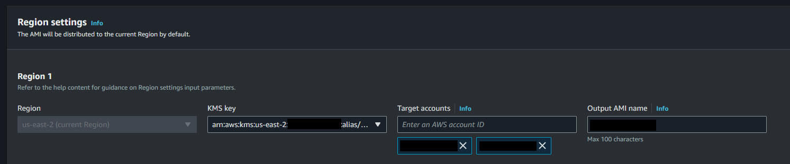

# EC2 Image Builder

This project created all of the resources for an Image Builder Pipeline with a **Tailscale** subnet router installation.

On top of subnet router [IP forwarding][3] settings, the image is also configured with Tailscale [performance best practices][4].

To see this image in use, check my other repository [epomatti/aws-rds-tailscale-vpn][2].

## Setup

Copy the `.auto.tfvars` file:

```sh
cp config/template.tfvars .auto.tfvars
```

You can find the latest image in SSM. Example for [Canonical images][5] used in this project:

```sh
aws ssm get-parameters --region us-east-2 --names \
   /aws/service/canonical/ubuntu/server/22.04/stable/current/arm64/hvm/ebs-gp2/ami-id
```

To create the project resources:

```sh
terraform init
terraform apply -auto-approve
```

Login to the AWS Console and start the build process manually.

A test instance will be automatically created by the workflow. If needed, a launch template is available to manually test the created image on EC2.

Checking the status of the CloudWatch agent:

```sh
/opt/aws/amazon-cloudwatch-agent/bin/amazon-cloudwatch-agent-ctl -m ec2 -a status
```

## Implementation

Recipe components:

- Linux update
- CloudWatch Agent
- Custom component for Tailscale with complete setup ([tailscale.yaml](./modules/imagebuilder/components/tailscale.yaml))
- Reboot

SSM agent is kept in the image to be used during launch. Vulnerability scan will be performed by the pipeline.

Additional information:

- Image Builder publishes managed or curated images which have higher update rates, but appear to be unavailable via other means. I've created this [thread][1] to learn more about it.
- EC2 build instances require internet access. This can be configured via NAT in the VPC, or enabling public IP addresses auto-assign.
- Make sure to make the installation completely noninteractive, for example with `DEBIAN_FRONTEND=noninteractive` for Debian-based distributions.

## Cross-account distribution

Steps documented following the cross-account distribution [documentation][6] with help from this [blob post][7].

**Requirement:** You'll need to create a KMS CMK key and use it in your image recipe.

### Source

In the Image Builder, create a distribution setting with the KMS CMK Key referenced and the target accounts.



Add this policy to the KMS CMK Key:

```json
{
   "Sid": "Enable cross-account Image Builder distribution",
   "Effect": "Allow",
   "Principal": {
         "AWS": [
            "arn:aws:iam::ACCOUNT_A:root",
            "arn:aws:iam::ACCOUNT_B:root",
            "arn:aws:iam::ACCOUNT_C:root"
         ]
   },
   "Action": [
         "kms:Encrypt",
         "kms:Decrypt",
         "kms:ReEncrypt*",
         "kms:GenerateDataKey*",
         "kms:DescribeKey",
         "kms:CreateGrant",
         "kms:ListGrants",
         "kms:RevokeGrant"
   ],
   "Resource": "*"
}
```

### Destination

1. Create the `EC2ImageBuilderDistributionCrossAccountRole` on each destination account. This role will be used by the **source** account. The trust policy should look like below, replacing the `SOURCE_ACCOUNT` with the source account id.
   ```json
   {
    "Version": "2012-10-17",
    "Statement": [
        {
            "Effect": "Allow",
            "Principal": {
                "AWS": "arn:aws:iam::SOURCE_ACCOUNT:root"
            },
            "Action": "sts:AssumeRole",
            "Condition": {}
        }
    ]
   }
   ```

2. Add the managed policy `Ec2ImageBuilderCrossAccountDistributionAccess` to the role.
3. Add this inline policy to the role:
   ```json
   {
	"Version": "2012-10-17",
	"Statement": [
		{
			"Sid": "AllowRoleToPerformKMSOperationsOnBehalfOfTheDestinationAccount",
			"Effect": "Allow",
			"Action": [
				"kms:Encrypt",
				"kms:Decrypt",
				"kms:ReEncrypt*",
				"kms:GenerateDataKey*",
				"kms:DescribeKey",
				"kms:CreateGrant",
				"kms:ListGrants",
				"kms:RevokeGrant"
			],
			"Resource": "*"
		}
	]
   }
   ```

### Other integrations

Additional access might be required for automation, since now services that will use your AMI will require access to the KMS CMK Key in cross-account setup.

```json
{
   "Sid": "",
   "Effect": "Allow",
   "Principal": {
         "AWS": [
            "arn:aws:iam::ACCOUNT_A:role/YourRoleStage",
            "arn:aws:iam::ACCOUNT_B:role/YourRoleProduction"
         ]
   },
   "Action": [
         "kms:Encrypt",
         "kms:Decrypt",
         "kms:ReEncrypt*",
         "kms:GenerateDataKey*",
         "kms:DescribeKey"
   ],
   "Resource": "*"
},
{
   "Sid": "",
   "Effect": "Allow",
   "Principal": {
         "AWS": [
            "arn:aws:iam::ACCOUNT_A:role/YourRoleStage",
            "arn:aws:iam::ACCOUNT_B:role/YourRoleProduction"
         ]
   },
   "Action": "kms:CreateGrant",
   "Resource": "*",
   "Condition": {
         "Bool": {
            "kms:GrantIsForAWSResource": "true"
         }
   }
}
```

---

### Clean-up

Destroy the resources after use:

```sh
terraform destroy -auto-approve
```


[1]: https://repost.aws/questions/QUwGgIFpv8SuyY6uvxlWIcyg/where-to-find-ec2-image-builder-managed-images
[2]: https://github.com/epomatti/aws-rds-tailscale-vpn
[3]: https://tailscale.com/kb/1019/subnets
[4]: https://tailscale.com/kb/1320/performance-best-practices#ethtool-configuration
[5]: https://canonical-aws.readthedocs-hosted.com/en/latest/aws-how-to/instances/find-ubuntu-images/
[6]: https://docs.aws.amazon.com/imagebuilder/latest/userguide/cross-account-dist.html
[7]: https://repost.aws/knowledge-center/image-builder-distr-error-encrypted-ami
